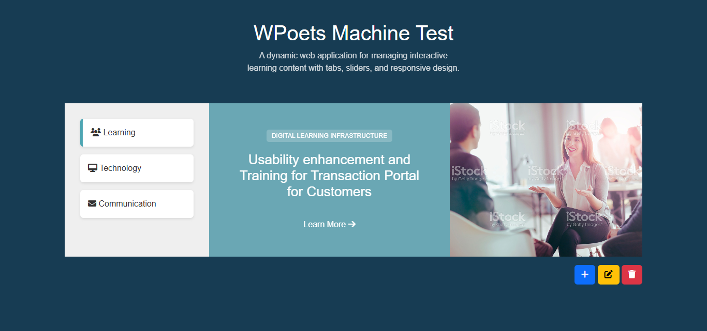

# WPoets Full Stack Responsive Content Slider

A dynamic web application for managing interactive learning content with tabs, sliders, and responsive design.

## Description

This project is a full-stack web application that provides an interactive learning platform. It features:

- Dynamic tab-based navigation
- Content sliders with image synchronization
- CRUD operations for managing slides
- Responsive design with mobile accordion
- Icon picker for custom tab icons
- Bootstrap-based UI with Slick carousel

## 📸 Screenshots

### Web View


### Mobile View


## Features

- **Desktop View**: Tab navigation on the left, slider in center, image on the right
- **Mobile View**: Accordion-style navigation with slides below each tab
- **CRUD Operations**: Create, read, update, delete slides
- **Dynamic Loading**: AJAX-powered content loading
- **Image Management**: Upload and display images for slides
- **Icon Selection**: Choose Font Awesome icons for tabs

## Technologies Used

- **Backend**: PHP, MySQL
- **Frontend**: HTML5, CSS3, JavaScript (jQuery)
- **UI Framework**: Bootstrap 5
- **Carousel**: Slick Slider
- **Icons**: Font Awesome
- **Icon Picker**: Bootstrap Iconpicker

## Installation

### Prerequisites

- XAMPP or similar PHP/MySQL server
- Web browser

### Setup Steps

1. **Clone or Download** the project to your web server directory (e.g., `htdocs`)

2. **Database Setup**:
   - Start XAMPP and open phpMyAdmin
   - Create a new database (e.g., `wpoets_test`)
   - Import the database schema from `db.php` or run the SQL queries manually

3. **Configuration**:
   - Update database credentials in `db.php` if needed
   - Ensure the `uploads/` directory is writable for image uploads

4. **Run the Application**:
   - Start Apache and MySQL in XAMPP
   - Open `http://localhost/your-project-folder/` in your browser

## Usage

### Desktop View
- Click tabs on the left to switch content
- Use slider dots to navigate slides
- Click Add/Edit/Delete buttons to manage slides

### Mobile View
- Tap accordion items to expand and view slides below
- Only one accordion item is open at a time

### Managing Content
- **Add Slide**: Click the + button to create new slides
- **Edit Slide**: Click the edit button on the current slide
- **Delete Slide**: Click the delete button to remove the current slide

## File Structure

```
├── index.php              # Main page
├── create.php             # Add new slide form
├── edit.php               # Edit slide form
├── delete.php             # Delete slide handler
├── db.php                 # Database connection and setup
├── fetch-tabs.php         # Fetch tab data
├── fetch-accordion.php    # Fetch accordion data
├── fetch-slides.php       # Fetch slide data
├── delete-slide.php       # AJAX delete handler
├── includes/
│   ├── header.php         # HTML head and navigation
│   └── footer.php         # Footer scripts
├── assets/
│   ├── css/
│   │   └── style.css      # Custom styles
│   ├── js/
│   │   └── main.js        # JavaScript functionality
│   ├── images/            # Static images
│   └── uploads/           # Uploaded slide images
└── README.md              # This file
```

## Database Schema

The application uses a single `slides` table with the following structure:

```sql
CREATE TABLE slides (
    id INT AUTO_INCREMENT PRIMARY KEY,
    tab_name VARCHAR(255) NOT NULL,
    tab_icon VARCHAR(255),
    tag VARCHAR(255),
    title VARCHAR(255),
    link TEXT,
    image VARCHAR(255)
    created_at TIMESTAMP DEFAULT CURRENT_TIMESTAMP
);
```

## Author

**Developed by: [**Taufik Khatik**](https://taufikkhatik.netlify.app)**

**Hosted by: [**WPoets**](https://www.wpoets.com/)**

## License

This project is licensed under the [MIT License](LICENSE).